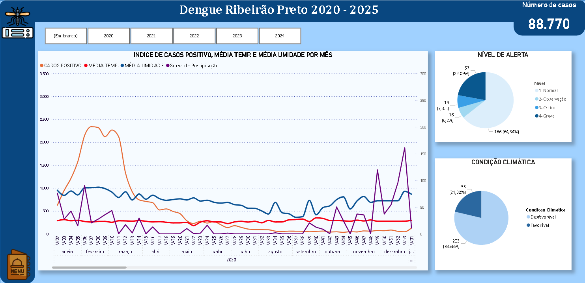
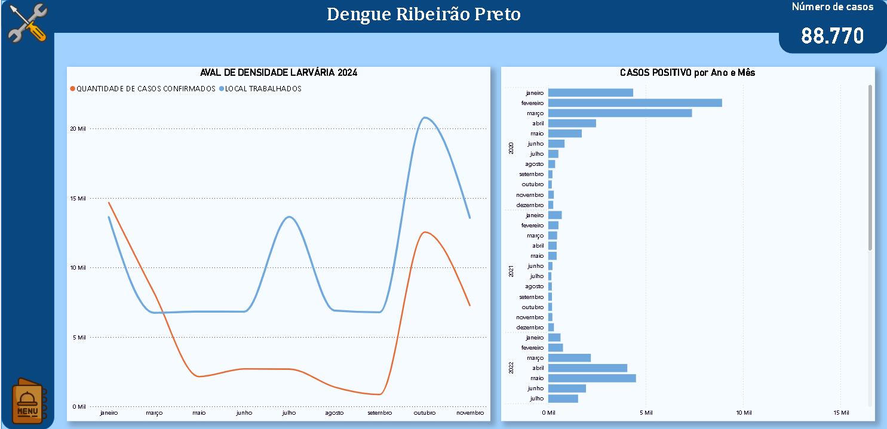

# Dashboard de Dengue - Power BI

Este projeto apresenta um dashboard interativo desenvolvido no Power BI para a análise epidemiológica da dengue em Ribeirão Preto/SP, abrangendo o período de 2020 a 2025.  
O estudo correlaciona dados de incidência da doença com variáveis climáticas locais, buscando identificar possíveis relações e padrões.

## Funcionalidades
- Evolução dos casos de dengue ao longo do tempo
- Comparação entre anos
- Análise cruzada com dados climáticos (temperatura, umidade e precipitação)
- Filtros interativos por período e variável

## Acesse o Dashboard Online
Você pode visualizar o dashboard publicado no Power BI através do link:  
[**Abrir no Power BI**](https://app.powerbi.com/groups/me/reports/f20b4410-79ac-4c51-919e-99151cdee757?ctid=cf72e2bd-7a2b-4783-bdeb-39d57b07f76f&pbi_source=linkShare&bookmarkGuid=f22c0fda-031f-4c23-b69f-552e01616cae)

## Artigo no Medium
Para uma explicação detalhada sobre a metodologia, tratamento dos dados e interpretação dos resultados, acesse o artigo completo:  
[**Análise epidemiológica da dengue em função de variáveis climáticas em Ribeirão Preto**](https://medium.com/@nicolasaws12/an%C3%A1lise-epidemiol%C3%B3gica-da-dengue-em-fun%C3%A7%C3%A3o-de-vari%C3%A1veis-clim%C3%A1ticas-em-ribeir%C3%A3o-preto-536efb1724dd)

## Estrutura do Repositório
- `dengue_dashboard.pbix` → arquivo do Power BI
- `dados/` → arquivos CSV/XLSX utilizados no projeto
- `imagens/` → capturas de tela do dashboard
- `Dashboard_Dengue.pdf` → versão estática para visualização rápida

## Como Visualizar Localmente
1. Baixe o arquivo `.pbix`
2. Abra no Power BI Desktop (gratuito)
3. Explore os filtros e visualizações

## Capturas de Tela
  

## Fontes dos Dados
- Casos de dengue: [VIGENT - Secretaria de Estado da Saúde de São Paulo](https://vigent.saude.sp.gov.br/sisawebinfo/)  
- Dados meteorológicos: [CIIAGRO](http://www.ciiagro.org.br/ema/)

## Observações
Os dados foram tratados e integrados exclusivamente para fins acadêmicos e de estudo.  
O dashboard é uma ferramenta de apoio para análise e visualização, não substituindo relatórios oficiais de saúde.
